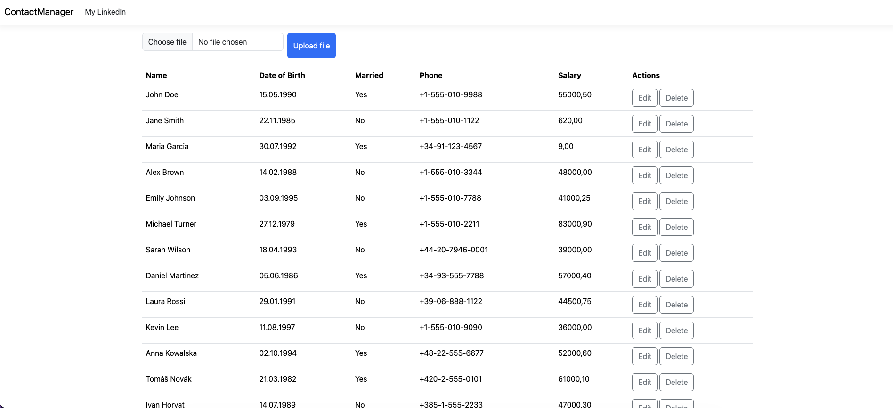

# Contact Manager Application
## An ASP.NET MVC application that allows users to upload a CSV file with the
following fields, store the data into MS SQL database, and display stored data on the page.

## CSV fields:

* Name [string]
* Date of birth [date]
* Married [bool]
* Phone [string]
* Salary [decimal]

## Implemented:
1. Server-side:
    * Usere are able to upload a CSV file containing the specified fields.
    * The application process the CSV file on the backend and save the data to
    an MS SQL database
2. Client-side
    * Users are able to filter and sort the data by any column using JavaScript
      on the client side.
    * The table support inline editing for any row, with an option to delete
      records from the database.
3. Additional Features:
    * Implemented basic data validation and error handling.

## Screenshots

### Main Page

### Sorted by name

### Sorted by salary

### Inline Edit 

### File Error

